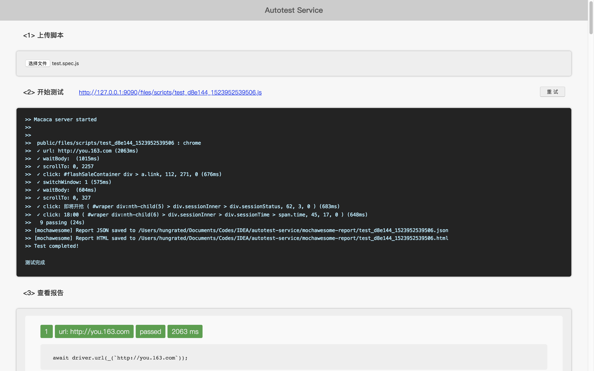
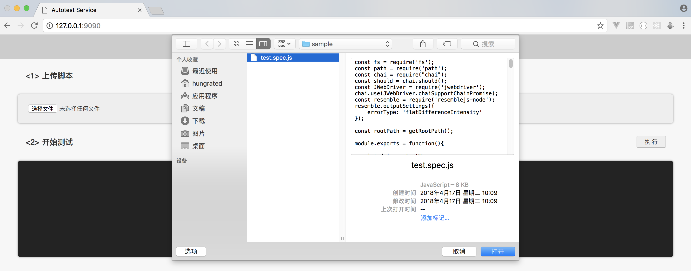
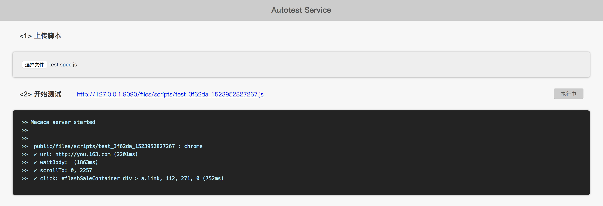
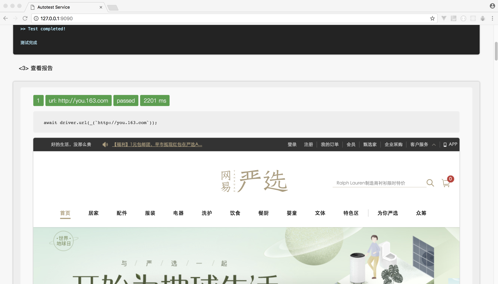

# 基于Windows Server与Node.js的多端Web自动化测试系统 - 配置与使用说明



项目地址：

`autotest-service`: https://github.com/Hungrated/autotest-service
 
`autotest-client`: https://github.com/Hungrated/autotest-client

> 该系统基于macaca自动化测试工具开发，运行于Windows Server与Node.js环境中，支持多用户并行操作，适用于中小规模有自动化测试需求的前端开发组使用。

### **特别注意：该系统只适合部署到内网环境，若部署到公网，将有极大的安全隐患！**


### 1 安装环境、工具包和驱动（在服务端和客户端均需完成）

将项目`autotest-service`克隆到服务端，项目`autotest-client`克隆到客户端，并按照官方文档安装好环境。

> 克隆之前请先阅读下面的注意事项。

* **注意：**  
1. **服务端克隆路径请避免空格，否则程序无法运行**；
2. 全局安装不要用`sudo`命令，推荐使用`nvm`安装node，可将node和npm安装到用户目录下（若安装在系统目录下，会导致测试脚本运行失败！）；
3. Java环境只支持Java 1.8，不支持Java 9；
4. 客户端和服务端各工具库的版本建议保持一致；
5. 可通过命令 `macaca doctor` 来检测安装环境。

#### 1.1 全局安装相关工具

```bash
npm i macaca-cli uirecorder selenium-standalone -g
```

#### 1.2 修改IP地址

进入`./app_paths.js`，将第4行的IP改为服务器IP

```jacascript
- const ip = '127.0.0.1';
+ const ip = currentServerHost;
```

#### 1.3 安装依赖库

依赖库配置信息如下所示，直接在根目录执行命令`npm i`即可。

```
// package.json
{
    "devDependencies": {
        "chai": "^4.1.2",
        "jwebdriver": "^2.2.5",
        "macaca-android": "^2.0.47",
        "macaca-chrome": "^1.0.7",
        "macaca-cli": "^2.1.2",
        "macaca-ios": "^2.0.30",
        "macaca-reporter": "^1.1.0",
        "macaca-wd": "^1.0.37",
        "mocha": "^5.1.0",
        "resemblejs-node": "^1.0.0"
    },
    "dependencies": {
        "opn": "^5.2.0",
        "path": "^0.12.7"
    }
}
```

* 注意：若为Windows或Linux环境，请取消`macaca-ios`的安装。

参考链接：https://macacajs.github.io/zh/environment-setup

### 2 利用 `uirecorder` 录制测试操作（仅在客户端完成）

#### 2.1 环境搭建

UI Recorder（录制回放器） - PC：

```
# 安装依赖
npm i --save-dev jwebdriver resemblejs-node

# 初始化uirecorder
uirecorder init

```

参考链接：https://github.com/alibaba/uirecorder

#### 2.2 开始录制

```
# 第一步：开启 uirecorder
uirecorder sample/test.spec.js

# 第二步：在弹出的浏览器中输入待测试网址

# 第三步：在浏览器中完成录制操作
```

### 3 回放录制的脚本（客户端访问服务端，进行多端测试）

#### 3.1 服务端初始化

```
# 第一步：服务端初始化 UI Recorder (配置建议和客户端相同，浏览器配置可按需增减)
uirecorder init

# 第二步：服务端启动 selenium server 服务
selenium-standalone install
selenium-standalone start

# 第三步：服务端运行app.js，启动测试平台（建议使用forever）
forever start app.js
```

#### 3.2 开始测试

* 访问`服务器ip:9090`进入主界面，选择在本地录制好的脚本文件；



* 点击执行按钮，可实时输出控制台的测试信息，此时服务端浏览器正在工作中；



* 当显示测试完成时，会自动生成本次测试时的报告，包括每个操作的编号、名称、是否通过、测试用例代码和耗时等信息，并配以截图直观显示测试结果；再点击右上角重试按钮可重新开始测试。


